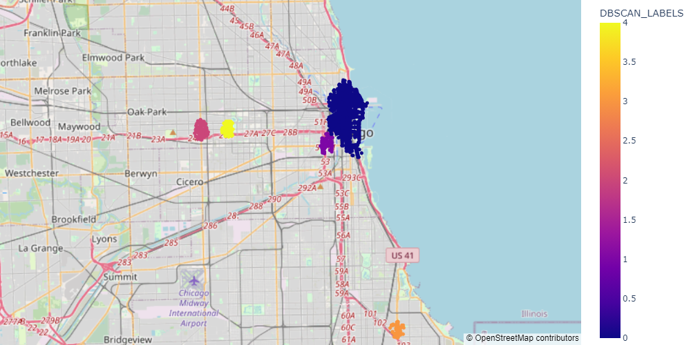
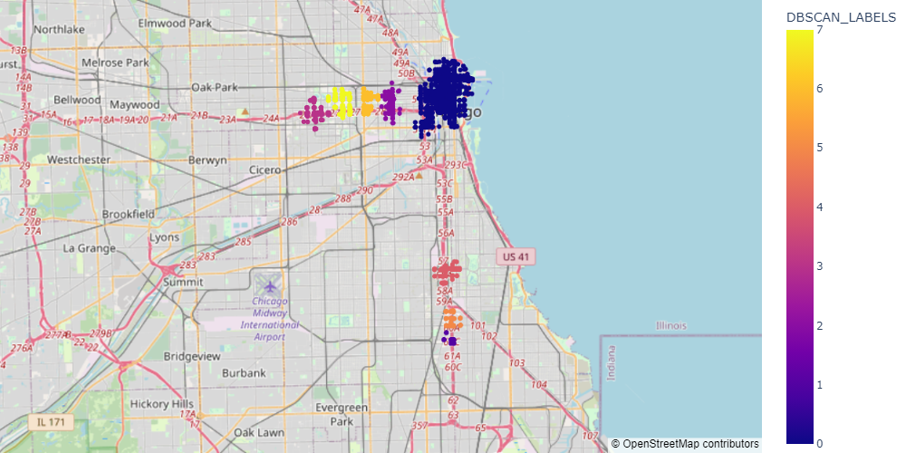
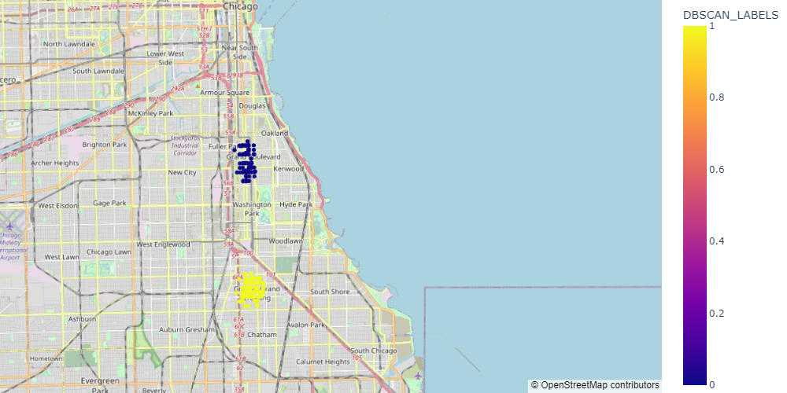
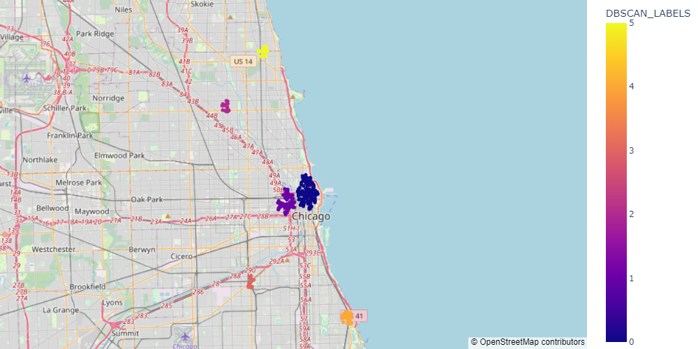

# Analyzing the traffic crash data of Chicago

The consequences of traffic accidents and crashes can be fatal and financially devastating to people. Analyzing the traffic crash data can help law enforcement authorities to take preventive measures and raise public awareness. Previous studies aimed to gain insights from the crash data by using various spatiotemporal tools. However, very few focused on clustering the crash data based on various categorical attributes of an accident. This study aims to prevent and reduce traffic accidents by analyzing the traffic crash data of Chicago. We explore the research questions on the causes, locations, and times of traffic accidents using different clustering algorithms suited for numerical and categorical attributes. Based on K-means, we found that most accidents happen from the evening to midnight. DBSCAN and OPTICS algorithms showed that the peak hours for accidents are 6 pm on Fridays and from 12 am to 4 am on Wednesdays to Saturdays, respectively. We also investigated the locations of accidents by their types. We identified that the leading causes of traffic accidents in Chicago’s central community area are speeding and running red lights. Along the US 41 highway, the accidents are caused by poor road conditions and a lack of road markings. We also noticed that in the Greater Grand Crossing and the Grand Boulevard area, the most frequent cause of traffic crashes is not stopping at the stop sign. Moreover, we examined that most accidents occur in areas without traffic control devices and on undivided, one-way, or divided roads with non-raised medians. Our study can provide valuable insights for the authority to improve road safety and lower the chances of accidents.

## Sample of generated clusters using DBSCAN

### Areas where primary cause of accidents: Failing to reduce speed to avoid crash
West Jackson Boulevard, West Madison Street, West Garfield Park, University of Illinois Chicago, Central side of Chicago

### Areas where primary cause of accidents: Disregarding traffic signals
Expressway, Central area, Dan Ryan Expressway

### Areas where primary cause of accidents: Disregarding stop sign
Greater Grand Crossing, Grand Boulevard

### Areas where primary cause of accidents: Vision obscured (signs, tree limbs, buildings, etc.)
Hyde Park, McKinley Park, Near North side, Around Near West Side, North Kedzie Avenue, West Devon Avenue, Near Roger's Park 
